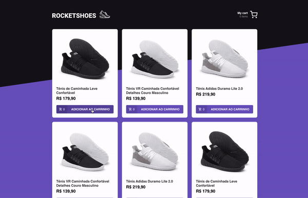

<p align="center">
    
</p>

<h1 align="center">
   Flux Redux with Saga
</h1>

<p align="center">


</p>

<p align="center">
  <a href="#computer-about-the-project">About the Project</a>&nbsp;&nbsp;&nbsp;|&nbsp;&nbsp;&nbsp;
  <a href="#hammer-technologies">Technologies</a>&nbsp;&nbsp;&nbsp;|&nbsp;&nbsp;&nbsp;
  <a href="#rocket-getting-started">Getting Started</a>&nbsp;&nbsp;&nbsp;|&nbsp;&nbsp;&nbsp;
  <a href="#mailbox-contacts">Contacts</a>&nbsp;&nbsp;&nbsp;|&nbsp;&nbsp;&nbsp;
  <a href="#memo-license">License</a>&nbsp;&nbsp;&nbsp;
</p>

<br>

<p align="center">
  
</p>

<br>

## :computer: About the Project

A React project that uses redux with saga to create a simple example of a Netshoes clone.

## :hammer: Technologies

This project was developed at the [RocketSeat GoStack Bootcamp](https://rocketseat.com.br/bootcamp) with the following technologies:

-  [ReactJS](https://reactjs.org/)
-  [Redux](https://redux.js.org/)
-  [Redux-Saga](https://redux-saga.js.org/)
-  [React Router v4](https://github.com/ReactTraining/react-router)
-  [Axios](https://github.com/axios/axios)
-  [Immer](https://github.com/immerjs/immer)
-  [Polished](https://polished.js.org/)
-  [React-Toastify](https://fkhadra.github.io/react-toastify/)
-  [styled-components](https://www.styled-components.com/)
-  [React-Icons](https://react-icons.netlify.com/)
-  [json-server](https://github.com/typicode/json-server)
-  [Reactotron](https://infinite.red/reactotron)

## :rocket: Getting Started

**Clone or Download the Repository**

```bash
$ git clone https://github.com/Johnny-Saraiva/flux-redux.git

# Open the folder
$ cd flux-redux

```

**Installing Dependencies**

```bash
# if you use yarn, run this:

$ yarn
```
or
```bash
# if you use npm, run this:

$ npm install
```

### To start the project:

```bash

$ yarn start

```

or
```bash

$ npm run start

```

## :mailbox: Contacts

Connect with me on [LinkedIn](https://www.linkedin.com/in/johnny-saraiva-701641164/).

## :memo: License

This project is under the MIT license. See the [LICENSE](LICENSE.md) for more information..

---

Made with ❤️ by Johnny Saraiva 👋 [Get in touch!](https://www.linkedin.com/in/johnny-saraiva-701641164/)
